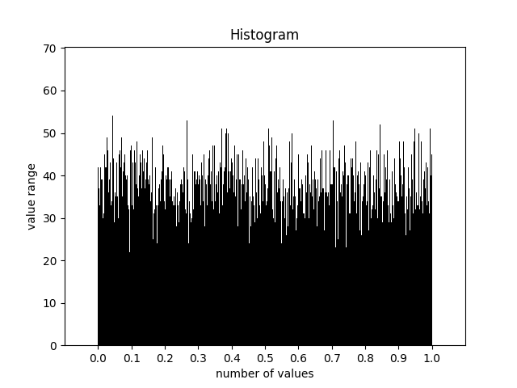

# Map-Reduce-Histogram-Plotting

The task is as follows: having a file with numerical values from [0, 1) and the number of ranges into which the interval [0, 1) is divided equally. For each range of values, find the number of keys in the source file that fall into it. Based on the resulting output file, generate a histogram as a picture.

The lines in the input file are as follows:
```
key \t ""
```
**Program output example**



**Map stage**:
* The source file is **split**.
* Each file is **processed** by a separate mapper, which prints to its output file lines of the following format:
```
key \t 1
````
* All output files are **combined** into one.

**Reduce stage**:
* The input file is **sorted** using *external sorting*.
* The source file is **divided** into files by ranges.
* Each file is **processed** by a separate reduce, which count the number of values in this file and print to output file.
* All output files are **combined** into one.

The output is a file with the number of values in the existing range.

**Histogram plotting stage**:
* Read the input file.
* Plotting histogram.
If the number of ranges is greater than 12, then the **x** axis will be divided into 10 ranges, otherwise on the number of ranges.
After the program is completed, we obtain the desired histogram in the form of a picture.

**create_histogram.py** — used to plot histogram. Used as follows:

```bash
chmod +x create_histogram.py
./create_histogram.py -n count_of_ranges -i input_file -o output_file_name
```

**generate.py** — used to generate tests. Used as follows:

```bash
chmod +x generate.py
./generate.py -n count_of_number -d name_of_output_file
```
**get_correct_answer.py** — used to get the correct number of values in each range. Used as follows:

```bash
chmod +x get_correct_answer.py
./generate.py -n count_of_range -i name_of_input_file -o name_of_output_file
```
**run.sh** — this is an example of how the main set of programs starts. Used as follows:

```bash
chmod +x run.sh
./run.sh
```
